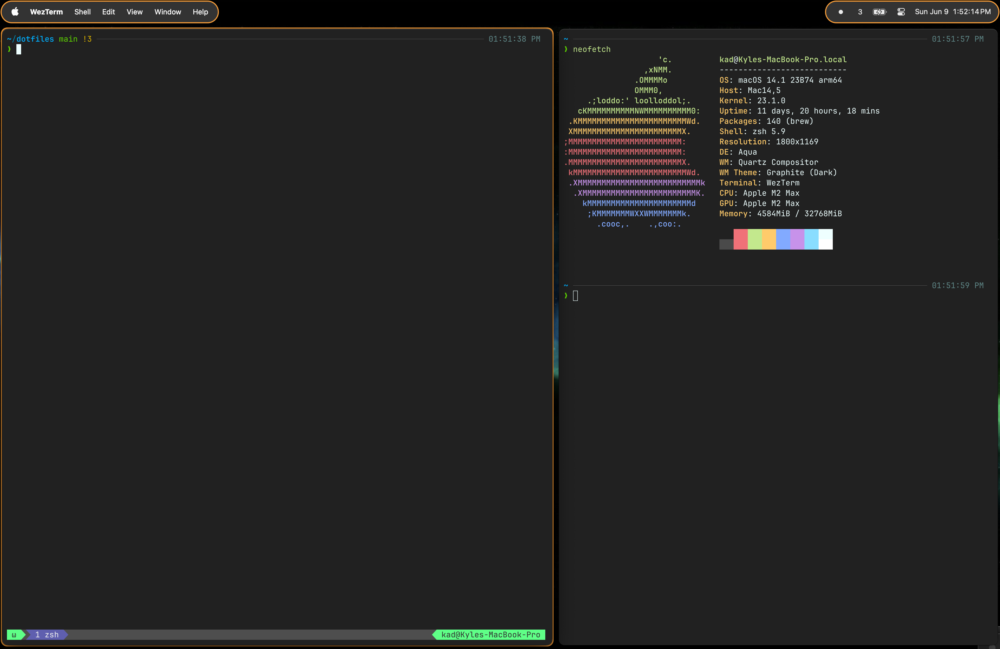

# `dotfiles`

# Overview

These are the dotfiles for my mac (and eventually other systems).

  

## Principles

- Most things should be ephemeral. Don't leave open lots of windows. Don't leave open lots of browser tabs.
  - Archive and persistently record things into Obsidian to restore work when relevant in the future.
- Make things work nicely for 1 single monitor on a laptop. This makes it easier to move and work wherever you have your laptopt, you don't need a second monitor as a "crutch".
  - (Nothing against second monitors, but I've found that I sometimes resist working while travelling when I depend on a second monitor too much)
- Don't go crazy with complex workflows/window managers. Things should be simple and easy to pick up. There aren't hundreds of complex hotkeys you need to memorize in order to do basic things.
- Easy setup. Automate as much as possible in the setup with a few commands (including things like updating mac system settings where possible).
  - This isn't possible for _everything_, but the manual steps will be recorded.

## Tools / Workflows

- Aerospace
  - Tiling Window Manager
  - I really like their concept of "virtual workspaces". It makes switching between them instant, unlike the normal mac workspaces.
  - I don't really use the tiling mode at all. I use it to automatically maximize windows and easily switch between common apps with hotkeys.
    - `alt-enter` → Terminal (WezTerm)
    - `alt-e` → **E**ditor (VSCode)
    - `alt-a` → **A**rc (Browser)
    - `alt-m` → **M**ail (Superhuman)
    - `alt-o` → **O**bsidian (Notes)
- [Ice](https://github.com/jordanbaird/Ice)
  - Menu bar management tool.
  - Helps clean up the top menu bar and add some basic styling. Has some quirks, but generally works well and is actively maintained.
- [JankyBorders](https://github.com/FelixKratz/JankyBorders)
  - Adds borders to windows.
  - Mostly a styling thing, but can also highlight the focused window.
- Alfred
- Arc
  - Set up workspaces and profiles to keep things organized and have separate spaces for different working modes.
- Obsidian
  - An extremely powerful note-taking tool.

# Contributing

Contributions are welcome, for more info see: [`CONTRIBUTING.md`](./CONTRIBUTING.md).

# License

[MIT](./LICENSE)
